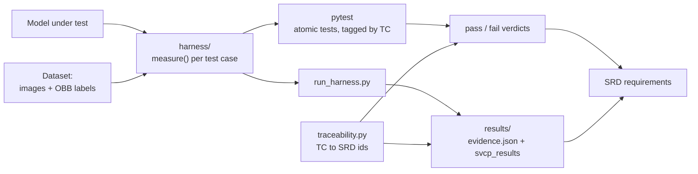

# YOLOv11n-OBB Verification Harness

A reproducible, black-box verification harness for an oriented-bounding-box (OBB) object
detector. It runs a set of SVCP (Software Verification Cases and Procedures) test cases against
the real model and dataset, expresses each case as many small atomic tests, and traces every
case back to the SRD (Software Requirements Data).

- **Black-box only** - observable inputs and outputs; no model internals, weights or gradients.
  White-box gradient attacks (FGSM/PGD) are out of scope.
- **Model- and dataset-agnostic** - everything specific lives in [`harness/config.py`](harness/config.py).
  Out of the box it runs on the bundled Ultralytics `yolo11n-obb` model and a 300-image DOTAv1
  validation subset, so the reference results below reproduce as-is.
- **Atomic and traceable** - one verification means per assertion; each test maps to a test case,
  and each test case maps to SRD requirements.

## Architecture



The `measure()` functions compute the evidence from the real model and data. `pytest` asserts the
acceptance criteria as atomic tests (the verdicts); `run_harness.py` writes the measured-evidence
report. Both attach SRD requirement ids through `traceability.py`.

## Requirements

- Python 3.10-3.12 and [`uv`](https://docs.astral.sh/uv/)
- [Git LFS](https://git-lfs.com) - the model and dataset are stored via LFS
- NVIDIA GPU optional (CPU works; latency numbers are device-dependent)

## Quickstart

```bash
git lfs install                     # the model + dataset are in Git LFS; install it before cloning
git clone git@github.com:prasannakotyal/yolov11obb-n-test-harness.git
cd yolov11obb-n-test-harness

uv venv .venv
uv pip install -e ".[dev]"          # harness + pytest

uv run pytest                       # atomic verification of every case vs the real model + data (~6 min)
uv run python run_harness.py        # write the measured-evidence report -> results/
```

The tests always exercise the real model and dataset; there is nothing to mock or skip. If you
cloned before installing Git LFS, run `git lfs pull` to fetch the real files. For GPU inference,
install the torch build matching your CUDA (otherwise torch is pulled in by ultralytics).

## Verification approach

Each SVCP test case is decomposed into small, single-purpose tests in its own file under
[`tests/`](tests) (`test_tc_<id>.py`). Every test asserts exactly one thing, so a failure points at
a specific defect rather than a whole case. For example, **TC-DATA-01** is checked by ten separate
tests (pairing, readability, MD5 duplicates, malformed labels, class-id range, class presence,
imbalance, ...). The current suite is **178 tests** (165 mapped to a test case, plus traceability
self-checks).

Every test is tagged with its case id via the `tc` marker, and the case id maps to SRD requirement
ids in [`harness/traceability.py`](harness/traceability.py) - so a failing test resolves directly to
the SRD requirement it affects. A few tests per case also pin the underlying statistic on
known-answer inputs (e.g. AUROC of a perfectly separable set is `1.0`; a unit-square polygon area
is `1.0`).

```bash
uv run pytest tests/test_tc_rob_01.py   # run one case
uv run pytest -m tc                      # run only the case-mapped tests
```

## Test cases

**Data-management verification**

| Case | Verifies |
|------|----------|
| `TC-DATA-01` | dataset integrity + class distribution (pairing, MD5 duplicates, malformed/out-of-range labels, imbalance) |
| `TC-DATA-02` | ODD coverage + desiderata (per-class coverage, small-object fraction, image-size range) |
| `TC-DATA-03` | train/val/test separation (MD5 exact + 16x16 average-hash near-duplicate detection) |
| `TC-DATA-04` | label-quality review (format + polygon-geometry validity over every object) |
| `TC-DATA-05` | data-drift monitoring (KS + Jensen-Shannon on brightness; control vs induced drift) |

**Black-box model validation**

| Case | Verifies |
|------|----------|
| `TC-ROB-01` | corruption robustness: 15 corruptions x 5 severities; detection-retention curve |
| `TC-ROB-02` | geometric robustness (metamorphic): flip / rotate / brightness / zoom-out |
| `TC-OOD-01` | OOD rejection: uniform-noise + block-scrambled inputs; AUROC + FPR@95%TPR |
| `TC-PERF-01` | per-class accuracy via `model.val()` (mAP50, mAP50-95, precision, recall) |
| `TC-TIM-01` | inference + end-to-end latency (mean + p95) |
| `TC-FUN` | detect/classify + output-schema validity |

Interface and failure-injection cases need a hardware test rig and are out of scope here.

## Traceability to the SRD

[`harness/traceability.py`](harness/traceability.py) is the single source of truth mapping each test
case to SRD requirement ids. The ids use neutral group codes so the table is not tied to any one
programme:

| Code | Group | Code | Group | Code | Group |
|------|-------|------|-------|------|-------|
| `FR` | functional | `IR` | interface | `FD` | failure-detection |
| `PR` | performance | `OR` | operational | `DF` | data/format |
| `TR` | timing | `CR` | constraints | `AI` | AI/ML |
| `SR` | safety | `DR` | dataset | | |

Edit that one file to match your SRD; the ids then appear in the "Traceability (SRD)" column of
`results/svcp_results.{csv,md}` and alongside each case's `evidence.json`.

## Repository layout

```
.
├── harness/
│   ├── config.py         # all model/dataset/device/threshold settings (the only file to edit)
│   ├── traceability.py   # test case -> SRD requirement map (single source of truth)
│   ├── metrics.py        # pure verification maths (AUROC, FPR95, drift, retention, schema)
│   ├── corruptions.py    # 15 corruptions x 5 severities + geometric transforms (pure image ops)
│   ├── common.py         # model load/predict, image IO
│   ├── data_tests.py     # TC-DATA-01..05   measure functions
│   ├── robustness.py     # TC-ROB-01..02    measure functions
│   ├── model_tests.py    # TC-PERF-01, TC-TIM-01, TC-FUN measure functions
│   └── ood.py            # TC-OOD-01        measure function
├── tests/                # one test_tc_*.py per case, each a set of small atomic tests
├── models/               # model under test (yolo11n-obb.pt)
├── data/                 # images/val + labels/val (DOTA-format OBB labels)
├── results/              # svcp_results.{csv,md} + <TC-ID>/evidence.json
└── run_harness.py        # measured-evidence report generator
```

## Configuring for a different model / dataset / thresholds

Edit [`harness/config.py`](harness/config.py):

- `MODEL_PATH`, `VAL_IMAGES`, `VAL_LABELS`, `CLASS_NAMES`, `DEVICE`, inference parameters
- `CLASSES_OF_INTEREST` to restrict coverage/accuracy reporting to a target subset (empty = all)
- acceptance thresholds: `INFER_BUDGET_MS`, `E2E_BUDGET_MS`, `ROB_MIN_RETENTION`, `MAX_LABEL_ERROR_PCT`, `DRIFT_ALPHA`
- sweep sample sizes: `ROB_IMAGES`, `OOD_IMAGES`, `TIM_IMAGES`, `FUN_IMAGES`

The Ultralytics data YAML is generated at runtime from config (`results/dataset.yaml`), so the repo
carries no machine-specific path.

## Reference run

`yolo11n-obb` on the bundled 300-image DOTAv1 val subset (NVIDIA RTX 3050 Laptop GPU). All 178
atomic tests pass; key measured values per case:

| Test case | Key measured value(s) |
|-----------|-----------------------|
| TC-DATA-01 | 18,451 instances, 15 classes, imbalance 82.4, 0 duplicates |
| TC-DATA-02 | 15/15 classes >=5 instances; 24.9% objects <20 px |
| TC-DATA-03 | 0 exact / 0 near duplicates within val |
| TC-DATA-04 | label error rate 0.0% over 18,451 objects |
| TC-DATA-05 | induced drift KS p=3e-47 (detected); control p=0.36 (not flagged) |
| TC-ROB-01 | retention sev1 0.95 -> sev3 0.75 -> sev5 0.48 (graceful) |
| TC-ROB-02 | mean retention 0.98 over 8 transforms |
| TC-FUN | 98% images with detections; schema valid 49/50 |
| TC-TIM-01 | inference 15.0 ms (p95 62.7); end-to-end 21.7 ms |
| TC-PERF-01 | mAP50 0.618, mAP50-95 0.467, P 0.809, R 0.581 (per-class in evidence.json) |
| TC-OOD-01 | AUROC 0.776, FPR@95TPR 1.0, OOD confident-detection rate 0.49 |

Per-class accuracy (TC-PERF-01) and the OOD AUROC (TC-OOD-01) carry TBC acceptance thresholds, so
their atomic tests check validity and meaningful invariants (AUROC above chance, mAP50-95 <= mAP50,
ID more confident than OOD) while the measured numbers are recorded for the authority to assess.

## Assumptions and limitations

- The bundled DOTAv1 `yolo11n-obb` is a stand-in to make the harness reproducible; re-point
  `config.py` at the model and labelled dataset actually under verification.
- All `(TBC)` thresholds are placeholders to confirm with the certification authority; reported
  numbers are **measured**, not assumed.
- `TC-OOD-01` uses a simple max-confidence black-box score; the measured AUROC and the rate of
  confident detections on block-scrambled inputs (about half) are recorded as evidence.
- Latency depends on the host device (reported in the results header); final acceptance is on the
  deployment target hardware.
- Randomised cases (`TC-ROB`, `TC-OOD`) are seeded (`config.SEED`) for reproducibility but may shift
  slightly across GPU/driver versions.

## Data and Git LFS

The model (`models/`, ~6 MB) and the validation subset (`data/`, ~215 MB) are tracked with **Git
LFS** so the harness runs out-of-the-box. Install Git LFS before cloning (`git lfs install`); if you
already cloned without it, run `git lfs pull`.
